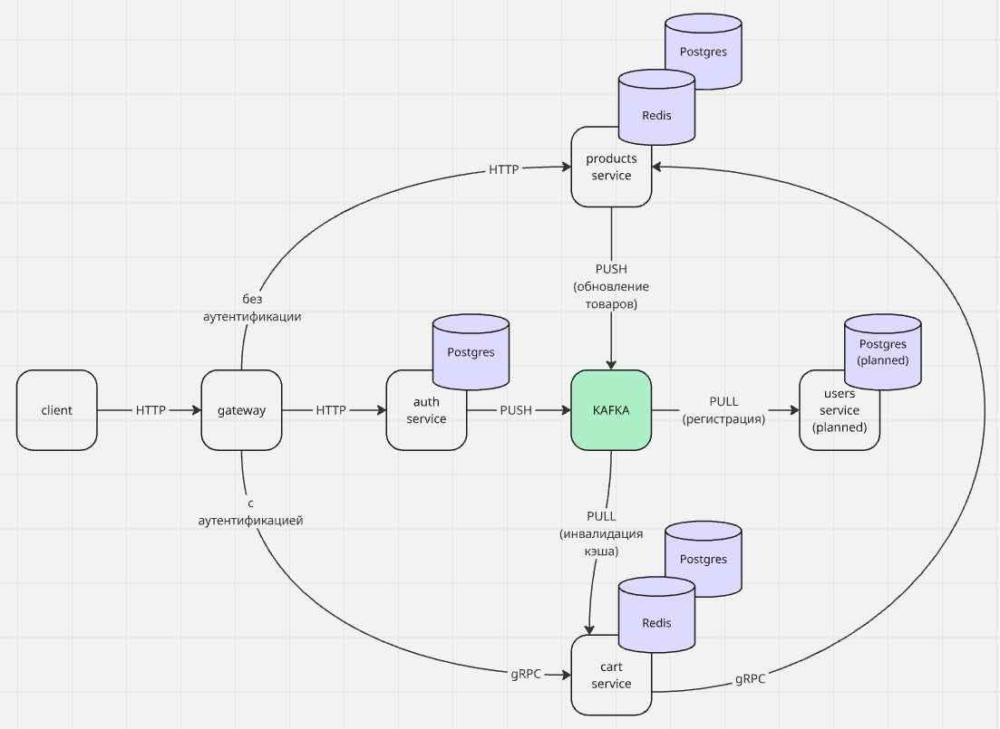

# E-Commerce Microservices Platform

Проект представляет собой микросервисную платформу интернет-магазина, разработанную на Go.

Основная цель проекта — продемонстрировать построение микросервисной архитектуры с использованием современных инструментов и подходов:

* HTTP API;
* gRPC;
* PostgreSQL;
* Redis;
* Kafka;
* RabbitMQ;
* Docker Compose;
* Prometheus;
* Grafana;
* Loki;
* Swagger.

Проект разделён на независимые сервисы, каждый из которых отвечает только за собственную область ответственности.

---

# Возможности проекта

В текущей версии реализованы:

* регистрация и авторизация пользователей;
* выпуск и проверка JWT-токенов;
* единая точка входа через API Gateway;
* каталог товаров;
* корзина пользователя;
* взаимодействие сервисов по gRPC;
* асинхронное взаимодействие через Kafka и RabbitMQ;
* кэширование данных в Redis;
* хранение данных в PostgreSQL;
* мониторинг и централизованное логирование.

---

# Архитектура

Проект построен по микросервисной архитектуре.



Подробное описание архитектуры находится в документе:

```text
docs/architecture.md
```

---

# Структура проекта

```text
project/
│
├── gateway/
├── auth/
├── products/
├── cart/
│
├── grafana/
├── prometheus/
│
├── docs/
│   ├── architecture.md
│   ├── services.md
│   └── planned-services/
│       └── users.md
│
├── compose.yaml
├── compose.infra.yaml
└── README.md
```

---

# Сервисы

| Сервис   | Назначение                                                       |
| -------- | ---------------------------------------------------------------- |
| Gateway  | Единая точка входа, маршрутизация HTTP-запросов, middleware, JWT |
| Auth     | Регистрация пользователей, авторизация, выпуск JWT               |
| Products | Хранение каталога товаров, HTTP/gRPC API, публикация событий     |
| Cart     | Управление корзинами пользователей                               |
| Users    | Планируемый сервис пользовательских профилей                     |

Подробное описание сервисов:

```text
docs/services.md
```

---

# Используемые технологии

## Backend

* Go
* Gin
* gRPC

## Хранение данных

* PostgreSQL
* Redis

## Брокеры сообщений

* Kafka
* RabbitMQ

## Наблюдаемость

* Prometheus
* Grafana
* Loki
* Promtail

## Инфраструктура

* Docker
* Docker Compose

## Документирование

* Swagger
* Protocol Buffers

---

# Взаимодействие сервисов

В проекте используются несколько способов взаимодействия.

### HTTP

Внешние клиенты работают только с Gateway.

### gRPC

Используется для синхронного взаимодействия между внутренними сервисами.

### Kafka

Используется для публикации событий об изменении товаров и инвалидации кэша.

### RabbitMQ

Используется для обработки событий регистрации пользователей.

---

# Быстрый запуск

## Клонирование репозитория

```bash
git clone https://github.com/LevYur/project.git
cd project
```

---

## Настройка окружения

Для каждого сервиса создайте файл конфигурации на основе шаблона.

Например:

```text
gateway/config/.env.example  →  gateway/config/.env.local
auth/config/.env.example     →  auth/config/.env.local
products/config/.env.example →  products/config/.env.local
cart/config/.env.example     →  cart/config/.env.local
```

При необходимости измените параметры подключения (например, пароли PostgreSQL или адреса сервисов).

---

## Требования перед запуском проекта

Перед запуском убедитесь, что установлены:

- Go 1.24+
- Docker
- Docker Compose
- Make

## Запуск проекта

Поднять инфраструктуру и все сервисы:

```bash
make up
```

---

## Просмотр логов

```bash
make logs
```

---

## Запуск тестов

```bash
make test
```

---

## Остановка проекта

```bash
make down
```

После запуска будут доступны:

* Gateway API;
* Swagger UI;
* Prometheus;
* Grafana.

---

# Документация

| Документ                       | Описание                            |
| ------------------------------ | ----------------------------------- |
| docs/architecture.md           | Общая архитектура проекта           |
| docs/services.md               | Описание всех сервисов              |
| docs/planned-services/users.md | Описание планируемого Users Service |
| gateway/README.md              | Документация Gateway Service        |
| auth/README.md                 | Документация Auth Service           |
| products/README.md             | Документация Products Service       |
| cart/README.md                 | Документация Cart Service           |

---

# gRPC-контракты

Описание gRPC API вынесено в отдельный репозиторий:

```
project-protos
```

Это позволяет переиспользовать protobuf-контракты между сервисами и отделить описание API от реализации.

---

# Статус проекта

## Реализовано

* Gateway Service
* Auth Service
* Products Service
* Cart Service

## Запланировано

* Users Service

---

# Основные архитектурные идеи

* микросервисная архитектура;
* единая точка входа через Gateway;
* разделение ответственности между сервисами;
* database-per-service;
* gRPC для внутренних вызовов;
* Kafka и RabbitMQ для асинхронного взаимодействия;
* Redis для кэширования;
* централизованный мониторинг и логирование.

---

# Лицензия

Проект создан в образовательных целях для изучения микросервисной архитектуры, Go и сопутствующих технологий.